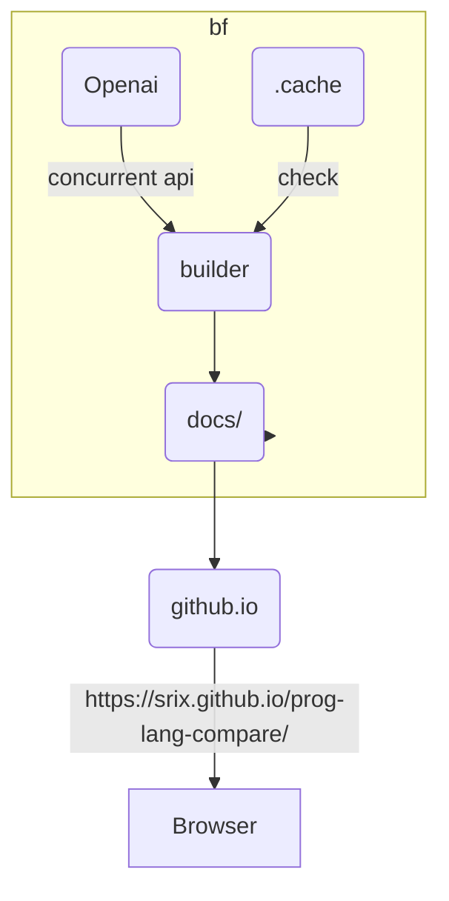

You can check the language comparison here [https://srix.github.io/prog-lang-compare/](https://srix.github.io/prog-lang-compare/)

Want to credit https://github.com/evmorov/lang-compare project for concept list.  
